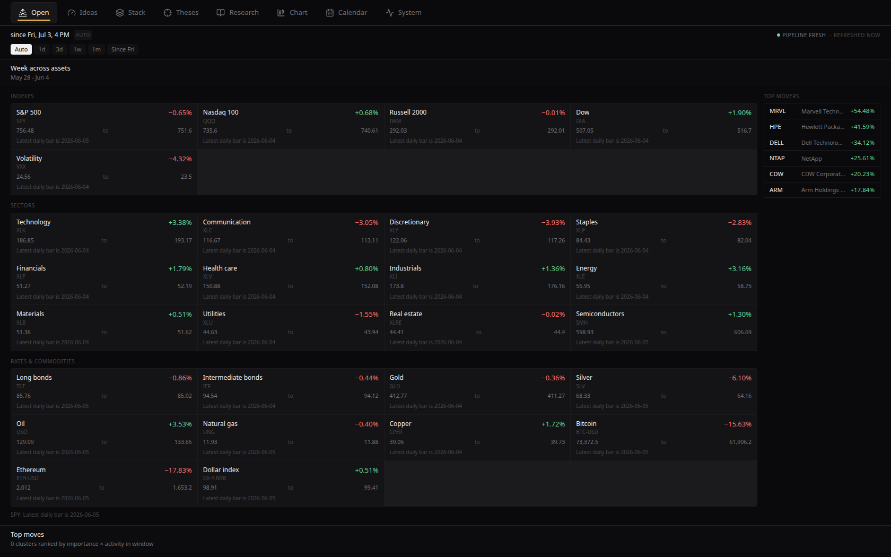
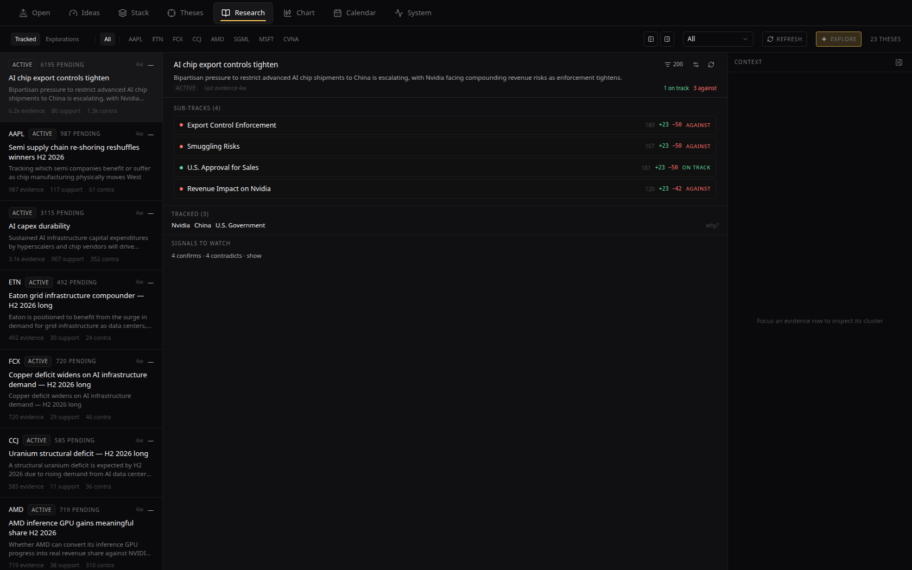
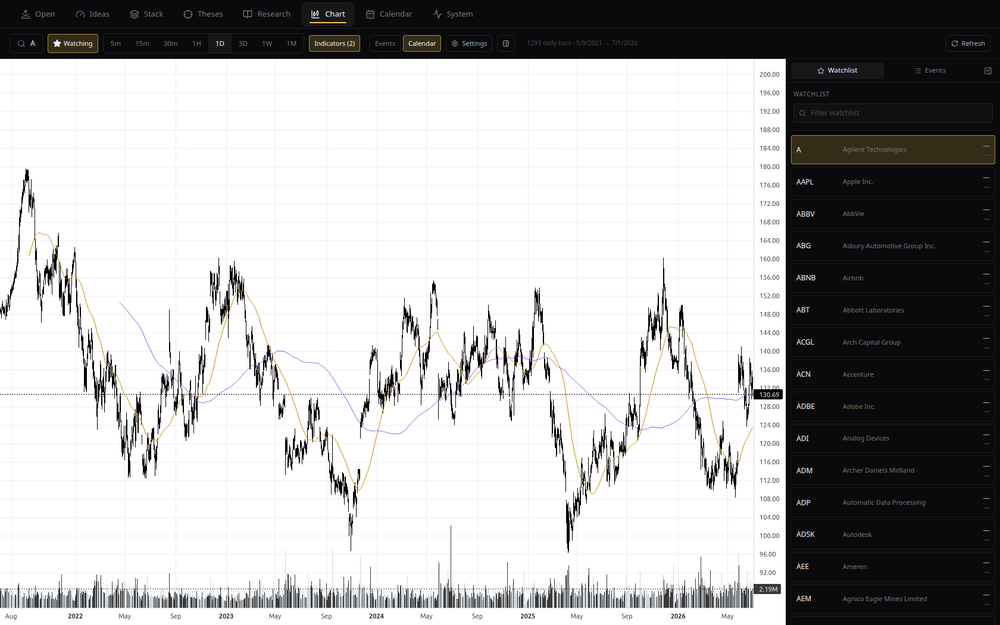

# MarketLens

Case study: [loganjones.dev/work/marketlens](https://loganjones.dev/work/marketlens/)

A local-first market research pipeline. It ingests public sources — SEC EDGAR, wire RSS, company IR feeds, FRED/BLS/BEA, Federal Reserve communications, FTC/DOJ/SEC enforcement, the Federal Register, CourtListener, industry analysts, tech press, Reddit, Finnhub — plus on-host audio transcription of earnings calls, and turns the stream into typed events with computed importance and a research workspace where hypotheses accumulate stance-classified evidence over time. Everything runs on one machine: the database, the models, the data.

## Screenshots







## Design philosophy

Research output is computed from a corpus the pipeline already curated, not generated from a model's parametric memory. Every step that can be arithmetic is arithmetic; the LLM is reserved for narrowly-scoped, constrained-JSON jobs where it has a real edge. Importance, conviction, source weight, novelty — all derived. Sentiment and stance — model judgments, but bounded by a thesis statement and grounded in cluster context. There is no general-purpose "ask the LLM about the market" surface, and there should not be one.

The local model sees a cluster — never a single headline — and does exactly three jobs: cluster-level structured extraction, stance classification against a thesis, and thesis-plan generation. It never produces an importance score, never picks what matters, and never answers from memory.

## The five-stage pipeline

1. **Source ingestion.** Pluggable sources poll EDGAR per CIK across the full filing surface (with chunked 8-K exhibit extraction), configurable RSS feeds, FRED macro series, CourtListener litigation, Federal Register rulemakings, Reddit, and Finnhub. Long-form filings are additionally chunked for passage-level matching.
2. **Embedding and cluster assignment.** Every article gets a 1024-dimension `bge-large-en-v1.5` embedding, then joins its nearest-neighbor cluster within a 7-day rolling window at 0.85 cosine similarity — or starts a new one.
3. **Triage classification.** A zero-shot DeBERTa sidecar labels each cluster against a typed event vocabulary. Below the confidence threshold, a cluster never reaches the LLM.
4. **Cluster-level event extraction.** One constrained-JSON call to a local Qwen model per confidently-triaged cluster: structured slots, sentiment, summary, magnitude. The event type is given, not asked.
5. **Importance computation.** `source_weight × novelty × event_class_prior × magnitude`, all arithmetic. Sources carry explicit reputation weights in five tiers, from EDGAR and FRED at the top down to Reddit and Finnhub, which are kept for breadth and expected to drown under low importance.

On top of the pipeline sits the research workspace: a thesis is a persistent, embedded hypothesis with rules, linked assets, and an accumulating evidence ledger. A matcher scans new articles, events, transcript segments, and filing chunks against every active thesis rule; a stance classifier labels each match as supporting or contradicting the thesis with a one-sentence rationale; the user confirms or overrides. Conviction is meant to be computed from that ledger, not typed into a chat box. The workspace design is specced in `docs/research-workspace.md`.

A pipeline run ledger records inputs, outputs, skips, and errors for every scheduled drain, so "is the pipeline healthy" is a query, not a guess.

## Stack

- **API** — .NET 10, EF Core, three projects (Api / Core / Infrastructure)
- **Web** — React + TypeScript + Vite, Tailwind, Radix primitives
- **Database** — Postgres 17 with pgvector
- **Embeddings sidecar** — HuggingFace `text-embeddings-inference` running `BAAI/bge-large-en-v1.5` (GPU)
- **Triage sidecar** — Python FastAPI running `MoritzLaurer/deberta-v3-large-zeroshot-v2.0` (GPU)
- **Whisper sidecar** — Python FastAPI running `faster-whisper large-v3`, with yt-dlp for earnings-call replay discovery (GPU)
- **LLM** — Ollama on the host running `qwen3:latest` for the three constrained-JSON jobs

## Running it

```
cp .env.example .env    # fill in API keys; see the file for which are optional
docker compose up -d    # postgres + embeddings + triage + whisper + api + web
```

API on `http://localhost:5210`, web on `http://localhost:5216`. The compose file expects Ollama running on the host at port 11434 and an NVIDIA GPU for the three model sidecars.

Two things to configure before real use:

- **EDGAR contact.** The SEC requires a contact email in the `User-Agent` of every EDGAR request. Set `Edgar:UserAgent` in `src/MarketLens.Api/appsettings.json` to your own identity before polling.
- **API keys.** `.env.example` lists the keys read by the compose file (Finnhub, FRED, EIA). All are optional — those sources are skipped at runtime if missing, and the sidecars and primary sources work regardless. Polygon.io (live index/futures quotes) is configured via `Polygon:ApiKey` in user secrets or configuration; without it the quotes view shows tickers in an unconfigured state and nothing else degrades.

For local development outside compose, EF Core migrations live under `src/MarketLens.Infrastructure/Migrations` and apply with `dotnet ef database update`.

This is a single-user POC: no authentication, everything bound to localhost.

## License

MIT — see [LICENSE](LICENSE).
